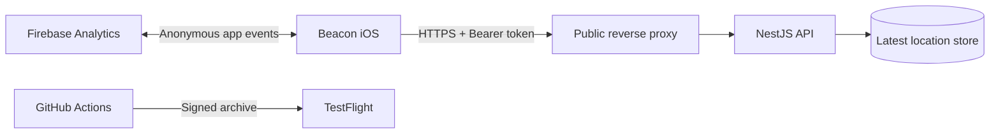

<p align="center">
  
</p>

<h1 align="center">Beacon</h1>

<p align="center">
  iPhone의 중요한 위치 변경을 감지해 내가 운영하는 서버로 전달하는 가벼운 위치 비콘.
</p>

<p align="center">
  <a href="https://github.com/WhiteKiwi/beacon/actions/workflows/ci.yml"></a>
  
  
  
  
</p>

## 왜 Beacon인가요?

상용 위치 공유 플랫폼에 계정과 이동 기록을 맡기는 대신, Beacon은 사용자가 지정한 HTTPS 엔드포인트로 필요한 데이터만 전송합니다. iOS의 Significant Location Change API를 사용해 배터리 소비를 낮추고, 최근 전송 결과는 기기에서 바로 확인할 수 있습니다.

| 기능 | 설명 |
|---|---|
| 저전력 백그라운드 전송 | 큰 위치 변화가 생겼을 때 iOS가 앱을 깨워 전송합니다. |
| 직접 운영하는 서버 | NestJS API와 Bearer 인증으로 데이터 경로를 직접 통제합니다. |
| 수동 전송과 이력 | 현재 위치를 즉시 보내고 최근 10건의 성공 여부를 확인합니다. |
| 개인정보를 고려한 분석 | 기본 비활성화된 Firebase Analytics를 사용자가 직접 허용한 경우에만 사용합니다. |
| 자동화된 배포 | GitHub Actions에서 서버/iOS를 검증하고 TestFlight 업로드를 수행합니다. |

## 아키텍처



위치는 `POST /api/locations`로 전송하고 `GET /api/locations/:id/latest`로 조회합니다. 자세한 계약은 [서버 명세](server/SPEC.md)에 있습니다.

## 빠른 시작

### 서버

```bash
cd server
cp .env.sample .env
# .env의 API_SECRET을 충분히 긴 임의 값으로 설정
pnpm install --frozen-lockfile
pnpm start:dev
```

기본 API 문서는 서버 실행 후 `/docs`에서 확인할 수 있습니다. 외부 공개 시에는 TLS를 종료하는 리버스 프록시 뒤에 두고 서버 포트를 직접 노출하지 않는 구성을 권장합니다.

### iOS

1. Xcode 26 이상에서 `ios/beacon.xcodeproj`를 엽니다.
2. Signing & Capabilities에서 본인의 Team을 선택합니다.
3. 선택 사항으로 Firebase의 `GoogleService-Info.plist`를 `ios/beacon/`에 둡니다.
4. 실기기에서 실행하고 HTTPS 서버 URL, Device ID, API Secret을 입력합니다.
5. 백그라운드 전송을 위해 위치 접근을 **항상 허용**합니다.
6. 익명 사용 분석은 선택 사항이며 기본적으로 꺼져 있습니다.

API Secret은 iOS Keychain에 저장됩니다. Firebase 설정 파일, 인증서, 프로비저닝 프로파일과 App Store Connect 키는 `.gitignore`로 보호됩니다.

## 저장소 구성

```text
beacon/
├── .github/           # CI, TestFlight, Dependabot, 이슈 양식
├── assets/brand/      # 앱 아이콘 고해상도 원본
├── ios/               # SwiftUI 앱과 Xcode 프로젝트
│   ├── ANALYTICS.md   # 분석 이벤트와 개인정보 메모
│   ├── SPEC.md        # 앱 동작 명세
│   └── ExportOptions.plist
└── server/            # NestJS 위치 수신·조회 API
    ├── SPEC.md        # API 계약
    └── src/
```

## CI/CD

- `CI`: 모든 PR과 `main` 푸시에서 서버 lint/test/build 및 iOS Simulator 빌드를 실행합니다.
- `TestFlight`: Actions에서 수동 실행하거나 `ios-v*` 태그를 푸시하면 고정 Distribution 인증서와 명시적인 App Store 프로파일로 서명한 아카이브를 App Store Connect에 업로드합니다. Hosted Runner가 Apple 계정에 인증서나 프로파일을 생성할 수 없도록 자동 프로비저닝은 사용하지 않습니다.
- 릴리스 비밀값은 GitHub의 `testflight` 환경에 저장하며 저장소 파일로 만들지 않습니다.

필요한 Actions secrets는 `ASC_KEY_ID`, `ASC_ISSUER_ID`, `ASC_KEY_P8`, `APPLE_TEAM_ID`, `GOOGLE_SERVICE_INFO_PLIST_BASE64`, `APPLE_DISTRIBUTION_CERTIFICATE_P12_BASE64`, `APPLE_DISTRIBUTION_CERTIFICATE_PASSWORD`, `APP_STORE_PROVISIONING_PROFILE_BASE64`입니다. 서명 인증서와 `Beacon App Store CI` 프로파일은 2027-08-26 전에 Bitwarden 백업을 기준으로 함께 교체해야 합니다.

## 문서

- [개인정보 처리방침](PRIVACY.md) · [App Store 제출 메모](app-store/METADATA.md)
- [iOS 명세](ios/SPEC.md) · [iOS 구현 메모](ios/IMPLEMENTATION.md) · [Analytics](ios/ANALYTICS.md)
- [서버 명세](server/SPEC.md) · [서버 구현 메모](server/IMPLEMENTATION.md)
- [기여 가이드](CONTRIBUTING.md) · [보안 정책](SECURITY.md)

## 기여

버그와 기능 제안은 이슈 템플릿을 이용해 주세요. 개발 환경과 PR 규칙은 [CONTRIBUTING.md](CONTRIBUTING.md)에 정리되어 있습니다.
